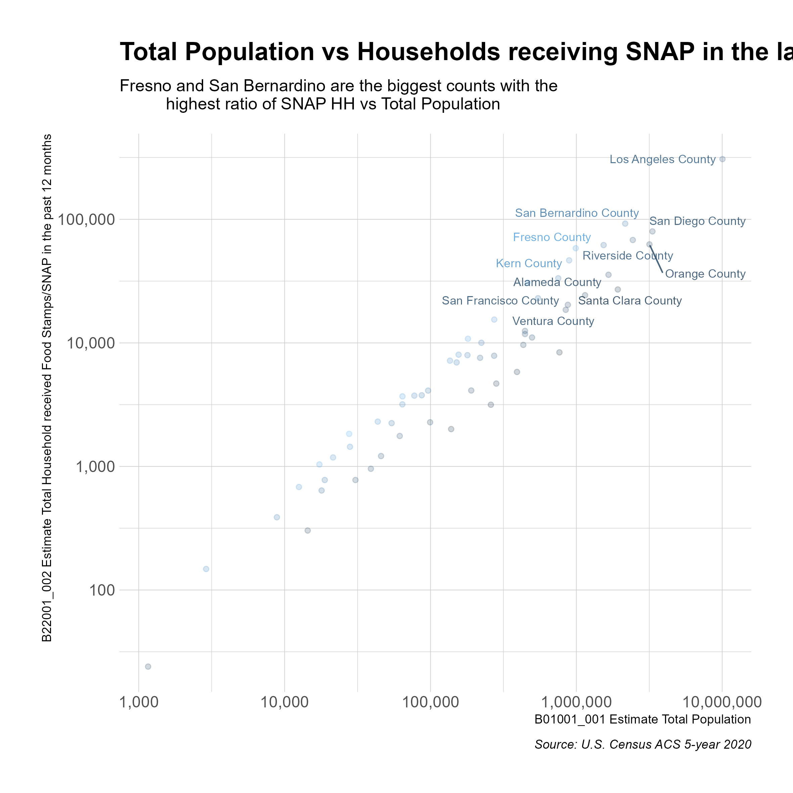

# CalFreshParticipation

<!-- badges: start -->
<!-- badges: end -->

The goal of this analysis is to provide insights of factors that produce variations in CalFresh participation across the 58 California Counties. The CalFresh program, also known as the Supplemental Nutrition Assistance Program (SNAP), is a federal program that provides food assistance to low-income individuals and families in California. With more than 4 million residents living below the poverty line, CalFresh is a crucial program that helps provide access to nutritious food for those in need.

By analyzing CalFresh participation rates by county, we can gain insights into the effectiveness of outreach efforts and identify areas where more resources may be needed to increase participation. Additionally, understanding the factors that influence CalFresh participation can inform policies and programs aimed at reducing food insecurity and poverty in California.

In order to understand the factors that influence CalFresh participation rates by county, a comprehensive dataset of over 100 variables was used sourced from the U.S. Census ACS 5-year 2020. These variables included demographic information, economic indicators, ie. income, property, education, age groups, etc. The dataset was then analyzed using statistical models, including least squares and forest trees, to generate estimates of participation rates for each county in California.

By using a robust methodology that accounts for multiple variables and utilizes advanced statistical models, this analysis provides a comprehensive understanding of the factors that influence CalFresh participation rates by county. This approach can also inform future research efforts and policy decisions aimed at improving access to the CalFresh program and reducing food insecurity in California. A special focus was placed in the data from San Bernardino County since it is one of the largest counties, in terms of population, that have the highest participation rates in the California. The interative version of this analysis is located here:  https://coquito77.shinyapps.io/CalFreshParticipationShinyApp/

